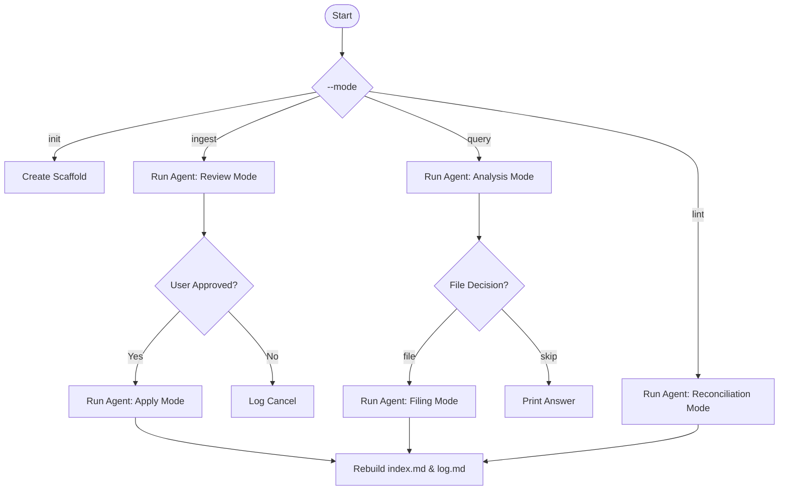

# Stage 4: Self-Filing Queries and Self-Healing Linting

## Stage Summary

* **Current Limitation**: In Stage 3, we had an auditable ingestion mechanism. However, as the wiki workspace accumulates pages:
  1. **Answering Questions Is Expensive**: Finding facts requires scanning the entire catalog.
  2. **No Memory of Answers**: Repeating the same query repeats the whole execution, burning tokens.
  3. **Schema and Concept Decay**: Dead links accumulate, contradictory claims slip in between different ingests, and orphan files drift without navigation pointers.
* **Why the previous design breaks**: The system is passive. It only handles ingestion. There is no active maintenance routine to ensure integrity, cross-linking, or question cache synthesis.
* **Why simpler fixes fail**: Simple vector search (RAG) splits text into arbitrary chunks, losing context of cross-page syntheses. Standard static file templates (like checking if links are broken using python regex) cannot resolve semantic contradictions or missing conceptual pages.
* **What new abstraction is introduced**:
  1. **Self-Filing Query Routing**: When querying (`query`), the agent answers the question and returns a `FILING_DECISION` (`file` or `skip`). If it selects `file`, the runner automatically launches a second write pass to document the Q&A in `/wiki/query/<slug>.md` and register it in `wiki/index.md`. Future runs read this prior query page as a routing shortcut.
  2. **Self-Healing Lint Loop**: A dedicated single-pass reconciliation execution mode (`lint`) checks the wiki for contradictions, orphan files, and concept coverage, fixing the files directly in `/wiki/` and generating a gap summary report.

---

## Full Working Code

See the runnable script: [stage_04_query_lint_orchestration.py](file:///home/openclaw/deepagents/llm_wiki_walkthrough/stages/stage_04_query_lint_orchestration.py).

Run a query check against a wiki:
```bash
uv run python stages/stage_04_query_lint_orchestration.py --mode query --repo adacomp --question "Who is Ada Lovelace?"
```

Run a maintenance check to heal the wiki structure:
```bash
uv run python stages/stage_04_query_lint_orchestration.py --mode lint --repo adacomp
```

---

## Detailed Explanation

### What Changed & Why It Matters
Stage 4 completes the architectural shape of the original repository:
* **Query Routing**: By forcing the agent to output `FILING_DECISION` and `FILING_REASON`, the host runner decides whether to save the answer in `/wiki/query/`. This turns past queries into first-class knowledge components that future runs can reference, bypassing slow synthesis.
* **Linting Reconciliations**: By inspecting `/log.md` and the pages, the agent acts as a garbage collector, ensuring cross-links remain valid and contradictory statements are resolved or explicitly documented as uncertainties.

### Tradeoffs Introduced
* **Decoupled States**: The query filing flow is implemented across two distinct passes (Query review -> parse decision -> optional Query apply), mirroring the review-apply split of Ingestion.
* **Agent Burden**: The lint loop is single-pass and applies immediately, making it fast but high-risk. If the agent makes a mistake during linting, it can corrupt multiple pages at once.

---

## LangChain + LangGraph Mapping

At Stage 4, script-first orchestration reaches its limits. Look at the code in `stage_04_query_lint_orchestration.py`: we have manual state branches, manual CLI parse handling, conditional routing for user confirmation, and two-pass conditional execution for both Ingestion and Queries.



### Why LangGraph Is Justified
When building complex systems:
1. **State Management**: Moving from variables inside a Python script to a structured state channel (`StateDict`) makes the agent's memory deterministic.
2. **Error Recovery**: In a simple script, if the script crashes midway (e.g. API timeout during the apply phase), the state is lost. LangGraph's checkpointers allow resuming executions exactly from the failed node.
3. **HITL (Human-in-the-loop)**: LangGraph supports native `interrupts` during graph execution, allowing us to pause before nodes (like the Apply phase) and resume with operator feedback without shutting down the Python process.

---

## Mentor Mode

* **Aha Insight**: A wiki is a living document database. Treat past answers as cached nodes. If the agent answers a question once, saving that answer inside the wiki allows the agent to immediately recall and build on it next time.
* **Common Mistake**: Building a single agent that attempts to read notes, write summaries, query, and lint all in one single massive system prompt. This results in prompt dilution and high hallucination rates. Instead, divide the features into separate execution modes (Ingest, Query, Lint), each with targeted, minimal prompts.
* **Tempting Simpler Alternative**: Storing past query answers in a database (like Redis or SQLite).
* **Why it fails**: Doing so hides the answers from the agent's filesystem context. By saving them as standard markdown pages under `/wiki/query/*.md`, the agent can inspect them using standard filesystem read tools, maintaining a unified interface.
